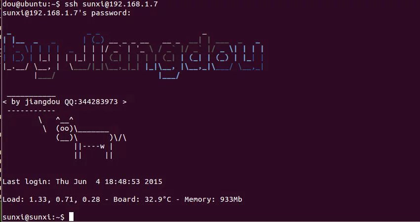

/*
* author by jiangdou 
* this A20_nad_FLASH-SDK 
* 
* time at 2015-05-25
*/

//how to build img for A20

1st 

 $ source tools/scripts/envsetup.sh

2st

 $ 

Please select to your Products 
   0 - a20-m160
   1 - jiangdou_a20-debian-server
please select a product:x    //select 0 or 1 !!!!! to for your Products
Creating working dirs

by jiangdou QQ:344283973  E-mail:jiangdouu88@126.com

Build nand image:
     a20_build_nand_image   //run  build img cmd !!

linux-SDK
---
##1.版本记录
| 版本 |  更新信息   | 作者  | 更新时间  |
| --- |  -------   | -----|----------|
|  1  | 创建初始版本 | jiangdou |2015-06-01|
|  2  |            |      |          |

##2.LOGIN
###2.1 

###2.2 
